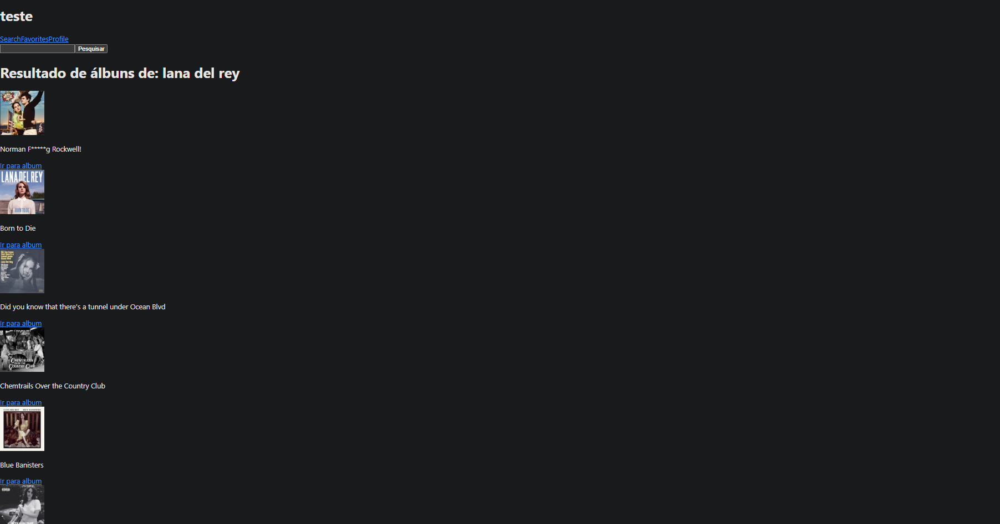

<p align="center">
  <a href="" rel="noopener">
 </a>
</p>

<h3 align="center">Trybetunes</h3>

<h1 align="center">
    
</h1>

---

<p align="center"> Projeto desenvolvido durante curso Trybe para aprender conceitos do react
    <br> 
</p>


## 🧐 Sobre <a name = "sobre"></a>
Foco na componentização, funcionamento de hooks e conciliação de typescript com react
integraçao da api do itunes

### todo 
Estilização

### Pré-requisitos

```
NodeJs e NPM
```

### Instalação

Instale as dependências

```
npm install
```

Inicie o servidor

```
npm run dev
```

## 🎈 Uso <a name="uso"></a>
buscar qualquer album de artista e favoritar, salvando no localstorage do navegador. 

## Disclaimer <a name="uso"></a>
Apenas codigo base do projeto foi criado por mim, restante foi disponibilizado pela Trybe


## ⛏️ Feito Com <a name = "feito_com"></a>
- [Reactjs](https://reactjs.org/) - Web Framework
- [Typescript](https://www.typescriptlang.org/)
