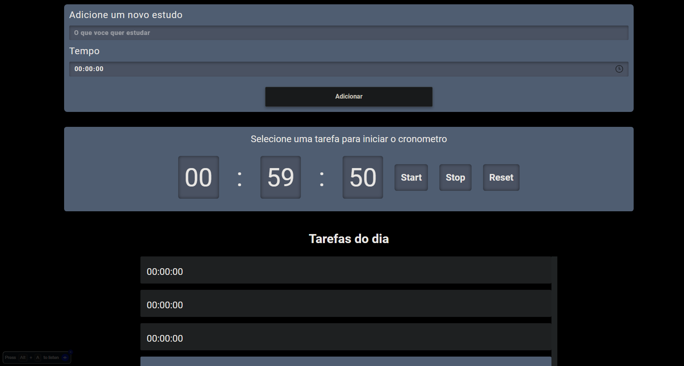

<p align="center">
  <a href="" rel="noopener">
 </a>
</p>

<h3 align="center">Spaceapp</h3>

<h1 align="center">
    
</h1>

---

<p align="center"> Projeto Simples para aprender conceitos basicos sobre React
    <br> 
</p>


## 🧐 Sobre <a name = "sobre"></a>
Projeto desenvolvido a partir de curso sobre react. Foco em aprender basico sobre estilização, componentização e funcionamento de hooks

### Pré-requisitos

```
NodeJs e NPM
```

### Instalação

Instale as dependências

```
npm install
```

Inicie o servidor

```
npm run build
npm run dev
```

## 🎈 Uso <a name="uso"></a>
Selecionar o tempo que deseja focar e começar o timer. Possibilidade de salvar multiplos timers e resetar o tempo

## ⛏️ Feito Com <a name = "feito_com"></a>
- [Reactjs](https://reactjs.org/) - Web Framework
